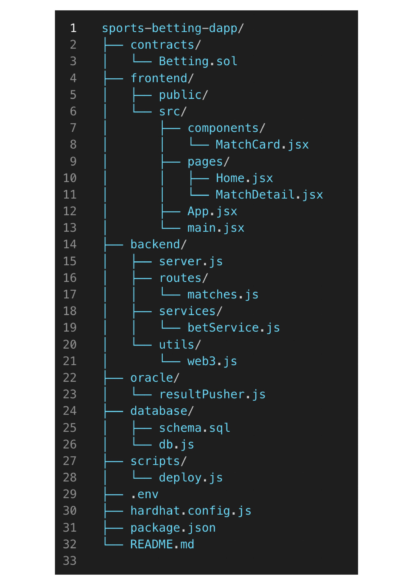

# Sports Betting DApp

A **decentralized sports betting platform** built using **Solidity, React, Node.js, and Web3**. Users can view matches, place bets, and receive automatic settlements via a secure oracle system.

This project follows a **modular architecture**, separating responsibilities across smart contracts, frontend, backend, database, and oracle services.

---

## Overview

The platform provides:

- **Smart contract** to manage matches, bets, payouts, and settlement  
- **React frontend** for browsing matches and placing bets  
- **Node.js / Express backend** for APIs and off-chain logic  
- **Custom oracle** to push match results to the blockchain  
- **SQL database** for match and backend metadata  
- **Hardhat setup** for compiling, testing, and deployment  

---

## 📁 Project Structure

## Technologies Used

### Blockchain
- Solidity  
- Hardhat  
- Ethers.js / Web3.js  

### Frontend
- React  
- Vite  
- Web3.js  

### Backend
- Node.js  
- Express.js  

### Database
- SQL (configurable)

---

## Installation and Setup

### 1. Clone the Repository

git clone https://github.com/yourusername/sports-betting-dapp.git
cd sports-betting-dapp 

## Security Notes

- Do NOT expose private keys in commits.

- Secure access to the oracle service.

- Smart contracts should be audited before production deployment.

- Validate backend inputs properly.

## Contributing

- Contributions are welcome!

- Fork the repository

- Create a feature branch

- Commit your changes

- Open a pull request

## License

- This project is licensed under the MIT License.
